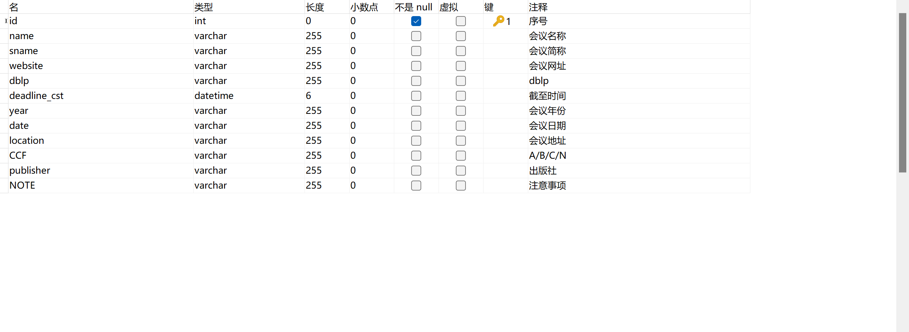
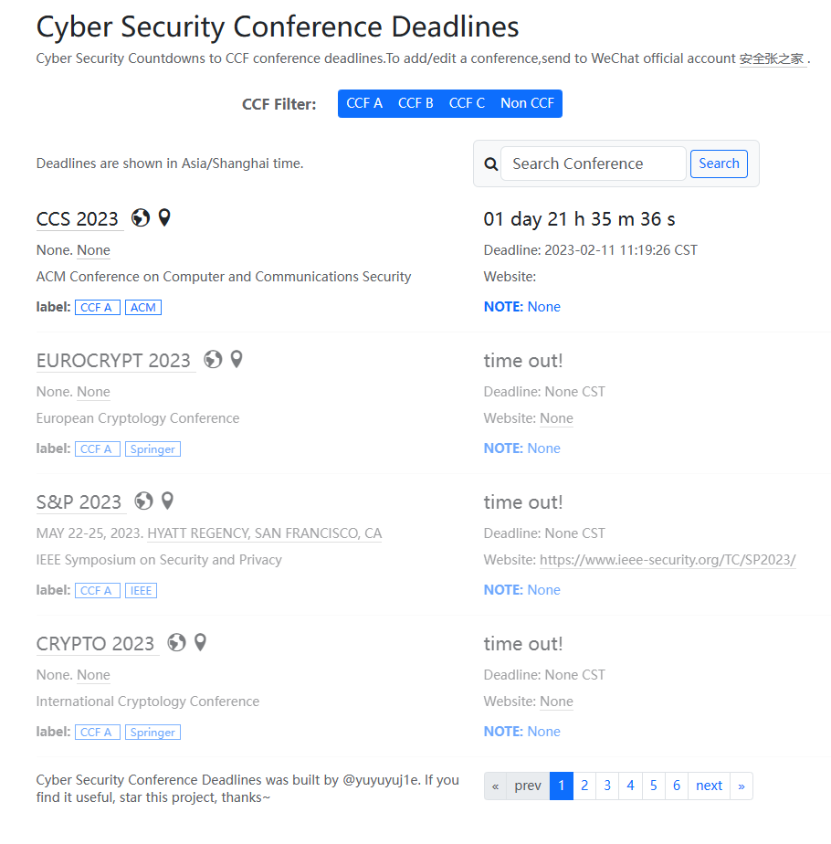

# conference-ddl
## 一、项目说明
### 1.1 项目描述
本项目采用 Flask 框架，实现了**查询网络安全领域相关期刊截至时间的网站**，支持实时展示截至剩余时间、定位会议地址与会议搜索。

### 1.2 应用技术
Python、Flask、HTML、JavaScript、CSS、MySQL

### 1.3 项目开源
https://github.com/yuyuyuj1e/Conference-Deadlines

## 二、环境配置
```
conda create -n ddl python==3.10
conda activate ddl
pip install flask==2.2.2
pip install pymysql==1.0.2
pip install flask-sqlalchemy
```

## 三、总结

### 3.1 主要工作
1. 收集网络安全相关期刊信息，将收集到信息存储到 MySQL 数据库中；
2. 通过 `Flask` 进行后端开发，通过 `jQuery` 框架和 `Bootstrap` 框架进行前端开发。

### 3.2 遇到的问题
1. **资源访问**

**问题描述**：前端若直接通过从后端获取会议数据，会提示 `The view function did not return a valid response.`。

**问题分析**：数据分页采用 `Flask-SQLAlchemy` 提供的 `paginate()` 方法，此方法返回的是 `QueryPagination` 对象，并不是 `string, dict, list, tuple` 等标准数据类型，因此无法直接发送。

**解决方案**：`Flask` 渲染网页时可以使用 `QueryPagination` 对象，因此可以通过 `url` 传递参数的方式，进行不同资源的访问。

2. **多个倒计时的实现**

**问题描述**：如何将倒计时函数应用到每一次会议上，使一个页面下的所有会议同时进行倒计时。

**问题分析**：实时倒计时需要通过更改网页标签的文字内容实现，多个倒计时函数同时进行时就需要让函数确定自己要更改哪一个标签。

**解决方案**：通过 `jQuery` 框架中的 `each()` 方法选定每一个 `item`，将 `$(this)` 即每一个 `item` 作为 `index` 参数传递给倒计时函数，从而使得倒计时函数确定获取的截至时间，并实时更新剩余时间。

3. **倒计时函数存在延迟**

**问题描述**：倒计时功能在打开网页时存在一段时间的延迟，无法直接进行工作。

**问题分析**：`setInterval` 方法在经过指定时长后才会触发，而刚打开网页时需要这段指定时长才能第一次触发倒计时函数，就是导致延迟的原因。

**解决方案**：将 `setInterval` 监听的函数取出，在设置 `setInterval` 之前先单独执行一次倒计时函数，之后才通过 `setInterval` 触发。

### 3.3 个人收获
1. 更清晰地认识和了解了网站的前端和后端的分工；
2. 加深了通过 `get, post, Ajax` 不同方式请求资源的理解；
3. 强化了阅读开发文档的能力

### 3.4 项目展示

#### 3.4.1 数据库字段


#### 3.4.2 网页预览
